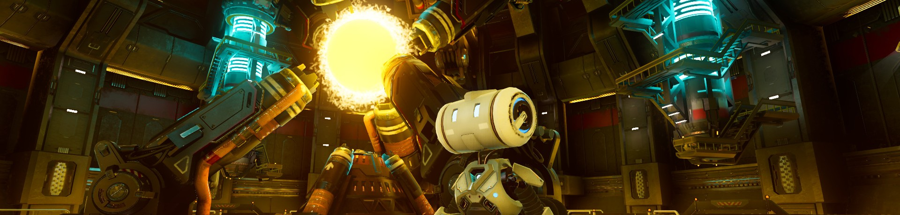

# Godot Engine - Projects

Repository containing my learning projects and experiments with Godot Engine.

---

## About

This repository serves as a portfolio of my progress learning game development with Godot. Here you'll find various prototypes, gameplay mechanics experiments, and study projects.

## Technologies

- **Engine**: Godot 4.5.1
- **Language**: GDScript & C#
- **Platform**: Cross-platform

## Repository Structure

Each folder represents an individual project with its own assets, scripts, and configurations.

## Learning Journey

This repository documents my journey learning:
- Game mechanics
- Godot's physics system
- GDScript and code architecture
- Level design
- Game UI/UX
- Shader Programming

---
